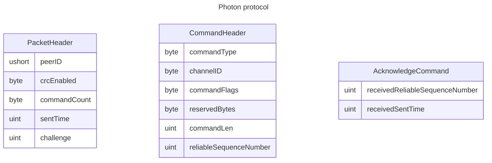

---
sidebar_label: 'Photon Networking - UDP'
sidebar_position: 3
---

# Photon Networking

## Overview

Scratching the surface of Photon UDP protocol

### UDP protocol basics
UDP is a connectionless protocol, that does not guarantee delivery of packets. It's up to the application to handle packet loss, ordering, and reliability.
UDP is commonly used in real-time applications, such as online games, where low latency is more important than reliability.
UDP packets are limited to 65,507 bytes in size, but in practice, the maximum size is much smaller due to network MTU (maximum transmission unit) limits. The typical MTU for Ethernet is 1500 bytes, which means that UDP packets larger than this size will be fragmented into multiple packets.

### Photon UDP protocol
Photon UDP protocol is built on top of UDP, and provides additional features such as reliability, ordering, and fragmentation.
As mentioned before, it is based on [ENet](http://enet.bespin.org/), a reliable UDP networking library.

#### Packet structure
[UDP](https://en.wikipedia.org/wiki/User_Datagram_Protocol) packet, is made up of a header and a payload.
There's few different packet types, that photon uses and they all share the same header structure.

Here's a breakdown of the UDP packet structure used by Photon.

From this structure, we can match the incoming packet to peer ( peer is a structure, representing a connection and its state.
I will later on, brake this down more, but for now, this serves as introduction.

:::note

Every packet starts with a PacketHeader, followed by one or more CommandHeader-command pairs.

:::